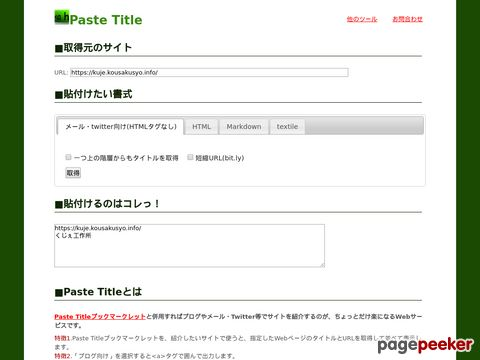

Get thumbnail from pagepeeker
====

This API by PHP that get the thumbnail images of the specified URL from [pagepeeker](https://pagepeeker.com/) and convert to it base64.  

## Description

August 2019, free.pagepeeker.com cannot obtain thumbnail images via SSL.  
This API by PHP is get the thumbnail images from free.pagepeeker.com and converts them to base64.  

## Example of use

[](https://kuje.kousakusyo.info/tools/PasteTitle/)
Thumbnail acquisition part in [Paste Title](https://kuje.kousakusyo.info/tools/PasteTitle/) (HTML or Markdown).  

## Requirement

This program has been tested with PHP7.  

## Usage

```
get_thumbnail.php?size=[size:string]&base64=[base64:boolean]&url=[url:string]
```

|No|Item|Comment|Example|
|--:|:--|:--|:--|
|1|size|Thumbnail size.<br>Select t,s,m,l,x.<br>See https://pagepeeker.com/website-thumbnails-api/ .|t|
|2|base64|Is the return value acquired in base64?|true|
|3|url|Thumbnail acquisition source.|https://kuje.kousakusyo.info/tools/PasteTitle/|

## Install

Put common.php and thumbnail.php in the same folder.

## Licence

[MIT](https://github.com/hiroshikuze/get-thumbnail-from-pagepeeker/blob/master/LICENSE)

## Author

[hiroshikuze](https://github.com/hiroshikuze)